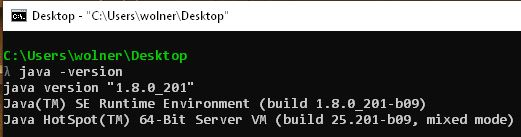
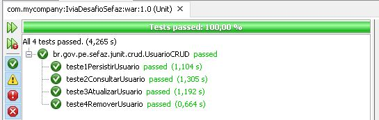
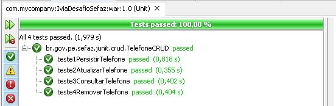

# IVIA - Desafio Sefaz v02

> Projeto desenvolvido para o desafio proposto pela Sefaz como parte da seleção para Desenvolvedor Java Júnior da IVIA.

Neste desafio eu busquei focar nos pontos mais relevantes que um projeto de software deve ter: definição e divisão das responsabilidade de cada componente, definição e controle na forma em que estes componentes interagem entre si, flexibilidade para correção de falhas/manutenção e uma estrutura que permita expansão. 


## Ferramentas utilizadas

[Apache Netbeans IDE 12.0 (LTS)](http://netbeans.apache.org/download/index.html) como ambiente de desenvolvimento da aplicação; <br>
[Apache Tomcat](https://tomcat.apache.org/download-90.cgi) como servidor para execução do projeto; <br>
[Apache Maven](https://maven.apache.org/) integrado ao Netbeans para controle de dependências, compilação e execução do projeto; <br>
[JUnit](https://mvnrepository.com/artifact/junit/junit) para execução dos testes de CRUD; <br>
[HSQLDB](http://hsqldb.org/) adotado como banco de dados relacional SQL.

## Sobre o projeto

Inicialmente minha idéia era criar um sistema em que, após o cadastro e login, o usuário pudesse visualizar os dados de todos os usuários, seus telefones e excluir e atualizar a vontade. Porém, no mundo real, não se usa um sistema assim (exceto sistemas com níveis de administrador) então eu decidi criar algo mais próximo da realidade. Deu mais trabalho, mas foi gratificante.

De forma simplificada: o usuário se cadastra, faz o login e dentro do sistema pode visualizar todos os usuários e seus telefones, sem  alterações ou exclusão. As únicas coisas que o usuário pode alterar e excluir são seus telefones e sua conta no sistema. Ou seja, apenas o próprio usuário altera e exclui seus dados. Com esta abordagem eu pude identificar pontos fortes e ponto para maturar como desenvolvedor.

## Vídeo demonstração

No video abaixo é possível visualizar a aplicação em execução.

[](http://www.youtube.com/watch?v=Uc9gxzgKAqU "Demonstração aplicação desafio Sefaz")

Ao acessar o sistema o usuário realiza seu cadastro e em seguida poderá efetuar login no sistema. <br>
Ao efetuar login corretamente, todos os usuarios cadastrados e seus telefones são exibidos (inclusive do próprio usuário). <br>
O usuario tem a opção de efetuar **logout** ou acessar seu **perfil**:

* **Perfil:** Exibe detalhes dos dados do usuário logado no sistema;
* **Logout:** Para sair do sistema.

Dentro do perfil o usuario pode verificar mais detalhes sobre seus dados, seus telefones e conta com alguns serviços:

* **Agenda:** Retorna para a visualização dos usuários e seus telefones;
* **Adicionar telefone:** Para casos em que o usuario passa a ter uma nova linha telefônica;
* **Alterar dados do usuario:** O usuario pode corrigir nome e email, caso necessário;
* **Alterar senha:** O usuário pode redefinir sua senha por questões de segurança;
* **Alterar telefone:** Para casos em que o usuário troca de chip ou DDD, por exemplo;
* **Apagar telefone:** Para casos de linha desativada ou pertencente a outro dono;
* **Excluir o perfil:** Apaga o usuário do sistema, sendo necessário um novo registro para efetuar login;
* **Logout:** Para sair do sistema.

## Requisitos obrigatório

```
• Utilizar a Plataforma – Java EE;
• Estruturar a aplicação em camadas;
• Uso de banco de dados relacional/SQL; (preferencialmente HSQLDB ou H2)
• Processo de build utilizando Maven;
• Persistência utilizando JDBC ou JPA;
• Utilizar no mínimo Java 8;
• Utilizar na interface JSF/Primefaces ou JSP com jQuery e Ajax;
• Disponibilizar o código em repositório Git online (Gitlab ou Github);
• O que você NÃO pode utilizar: Spring / Angular.
```
*Todos os requisitos obrigatórios foram utilizados e respeitados.*

### Uso da plataforma Java EE ✔

O projeto adota JavaEE e isto pode ser visualizado nas dependências do arquivo pom.xml, além dos próprios recurssos Java EE presentes no projeto como Servlets e JSP. Os servlets presentes neste projeto fazem uso dos métodos **doPut** (atualizar) e **doDelete** (excluir) além dos usuais **doGet** (buscar) e **doPost** (persistir).

```xml
<dependency>
    <groupId>javax</groupId>
    <artifactId>javaee-web-api</artifactId>
    <version>7.0</version>
    <scope>provided</scope>
</dependency>
```

### Estruturar a aplicação em camadas ✔

O projeto foi estruturado com base nos Design Patterns MVC e DAO de modo a permitir que cada componente da aplicação tenha suas responsabilidades bem definidas, permitindo assim uma maior flexibilidades para mudanças no projeto, bem como na sua manutenção. 

### Uso de banco de dados relacional/SQL (preferencialmente HSQLDB ou H2) ✔

Nesta etapa eu optei por utilizar o banco HSQLDB por dois motívos: sair do convencional MySQL e aprender algo novo. Gostaria de registrar que esta parte do desafio é interessante, pois essa decisão define o tratamento que será dado ao BD em todo o projeto. Por exemplo, o HSQLDB permite apenas uma conexão por vez quando criado no modo Standalone e isto significa que é preciso saber lidar constantemente com a gestão do banco (conectar, consultar, desconectar) e alterações no projeto seguido de testes.

Abaixo, a dependência do HSQLDB presente no arquivo pom.xml.
```xml
<dependency>
    <groupId>org.hsqldb</groupId>
    <artifactId>hsqldb</artifactId>
    <version>2.5.1</version>
    <scope>compile</scope>
</dependency> 
```

### Processo de build utilizando Maven ✔

Todo o projeto foi desenvolvido utilizando Maven. 
Abaixo, um snippet do conteúdo Maven presente no arquivo pom.xml, adicionado automaticamente após criação do projeto no Netbeans.

```xml
<plugin>
    <groupId>org.apache.maven.plugins</groupId>
    <artifactId>maven-compiler-plugin</artifactId>
    <version>3.1</version>
    <configuration>
        <source>1.7</source>
        <target>1.7</target>
        <compilerArguments>
            <endorseddirs>${endorsed.dir}</endorseddirs>
        </compilerArguments>
    </configuration>
</plugin>
<plugin>
    <groupId>org.apache.maven.plugins</groupId>
    <artifactId>maven-war-plugin</artifactId>
    <version>2.3</version>
    <configuration>
        <failOnMissingWebXml>false</failOnMissingWebXml>
    </configuration>
</plugin>
```

### Persistência utilizando JDBC ou JPA ✔

Para persistência no HSQLDB utilizei o JDBC juntamente com o Design Patterns Singleton. Desta forma, o modo como a aplicação lida com as conexões fica mais flúida, tendo em vista que o próprio HSQLDB so aceita uma conexão por vez.

### Utilizar no mínimo Java 8 ✔

A versão do java utilizada foi a 1.8.0_201. 



### Utilizar na interface JSF/Primefaces ou JSP com jQuery e Ajax ✔

Optei o uso do JSP para construção da View por ter mais afinidade com ela do que JSF. Fiz uso do JQuery para lidar com o comportamento de ocultar/exibir formulários e para o AJAX, optei pelo fetch para realizar as requisições assíncronas com os métodos doPut e doDelete dos servlets. Para complementar, fiz uso de mais JS além do fetch e utilizei CSS para definir o layout e as cores nas telas.

### Disponibilizar o código em repositório Git online (Gitlab ou Github) ✔

Aplicação disponível **neste** repositório.

### O que você não pode utilizar: Spring / Angular ✔

Esta regra foi respeitada e nenhum dos dois foram utilizados.

## Queries do BD

Os comandos SQL utilizados na construção do BD podem ser vistos abaixo.

*Tabela de usuário*
```sql
CREATE TABLE IF NOT EXISTS usuario(
    id IDENTITY PRIMARY KEY ,
    nome VARCHAR(100) NOT NULL,
    email VARCHAR(50) NOT NULL,
    senha VARCHAR(20) NOT NULL
);
```

*Tabela de telefone*
```sql
CREATE TABLE IF NOT EXISTS telefone(
	id IDENTITY PRIMARY KEY ,
	idUsuario INT NOT NULL,
	ddd INT NOT NULL,
	numero VARCHAR(13) NOT NULL,
	tipo VARCHAR(20) NOT NULL
);
```
**OBS:** É necessário alterar o parâmetro `pathBase` dentro do arquivo `ConexaoJDBC.java`, pois ele contém o caminho LOCAL que aponta para o banco de dados `sefaz`. 

## Requisitos desejáveis

Meu objetivo era gerar um link com a aplicação rodando no Heroku e realizar os testes de JUnit. No primeiro, a aplicação não estava conversando com o Postgre (BD usado no Heroku). Tentei buscar soluções, mas não resolvendo em tempo hábil, decidi voltar a investir no projeto e aprender JUnit para incrementar o projeto.

### JUnit

Testes de CRUD realizados para as classes Usuario e Telefone com resultados 100% OK.





### Autor

Guilherme Wolner Dias Monte | guilherme.wdm@gmail.com | linkedin.com/in/guilherme-wolner <br>
Dúvidas, críticas e sugestões podem entrar em contato.
